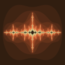

# nuunamnir.fractal-shaders
## Description
OpenGL shader based visualization of popular fractals. Heavily inspired by code examples of the [ModernGL](https://github.com/moderngl/moderngl) project.
## Installation and Requirements
Make sure to have a Python interpreter installed. Then, just clone this repository and get the dependencies via pip.
```
cd nuunamnir.georg-nees
pip install -r requirements.txt
```
## Usage
Run the Python script of the respective fractal; currently implemented is the Mandelbrot and the Julia fractal.
You can zoom into the fractal using the mouse wheel.
You can pan using left mouse button drag.
You can increase and decrease fractal detail (iterations) using left or right mouse button click respectively.
You can save the current view of the the fractal by pressing spacebar.
```
cd src
python generate.py -f {fractal_name} image_{0}.png
```
## Examples
### Mandelbrot Fractal
```
python generate.py -f mandelbrot -m mandelbrot_00 "../examples/mandelbrot_{0}.png"
```


### Julia Fractal
```
python generate.py -f julia -m julia_00 "../examples/julia_{0}.png"
```



